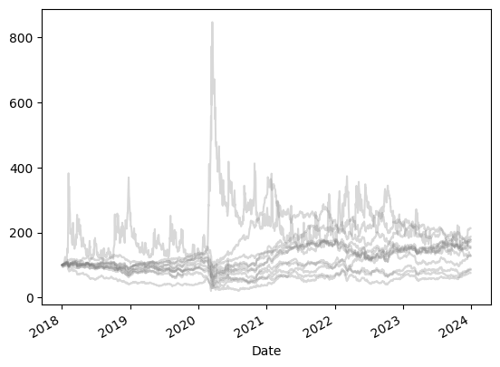
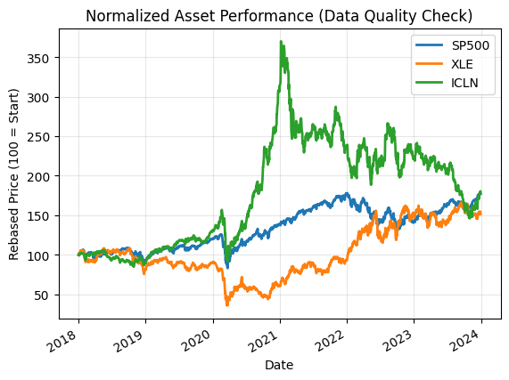
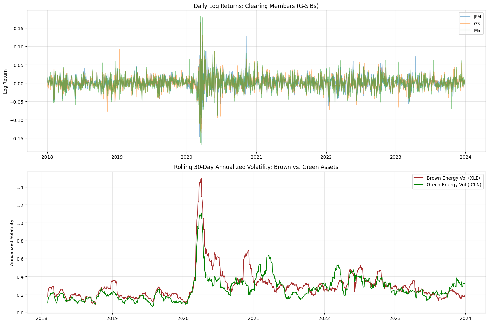
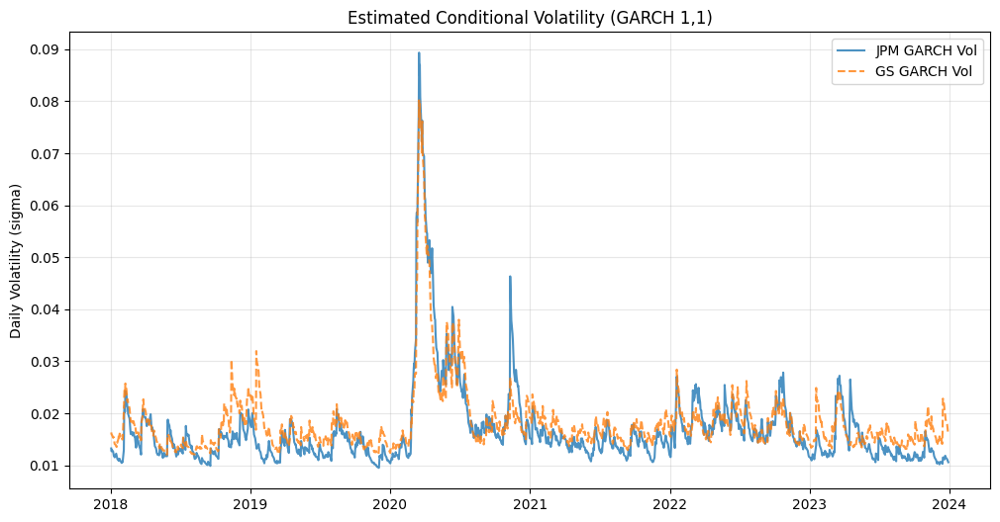
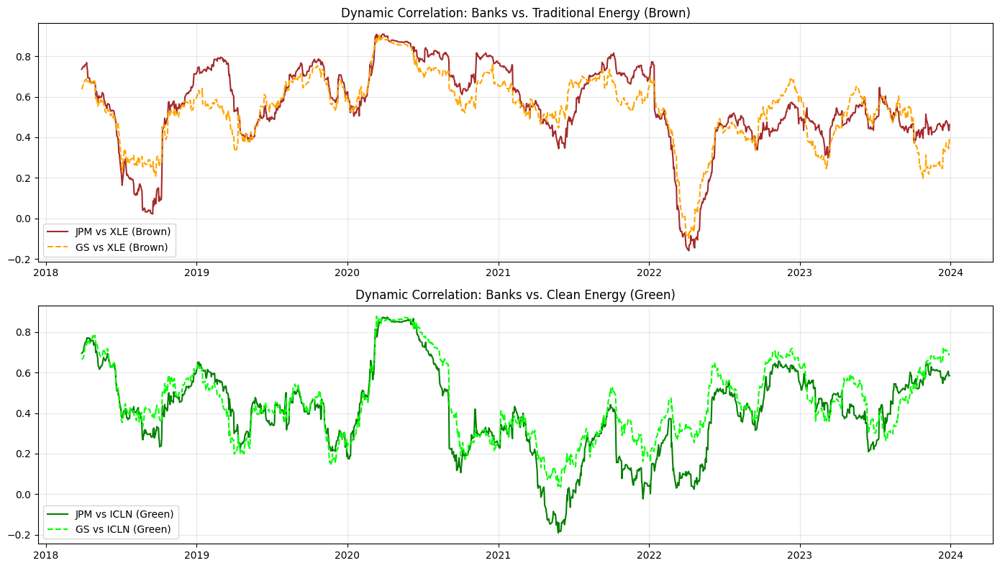
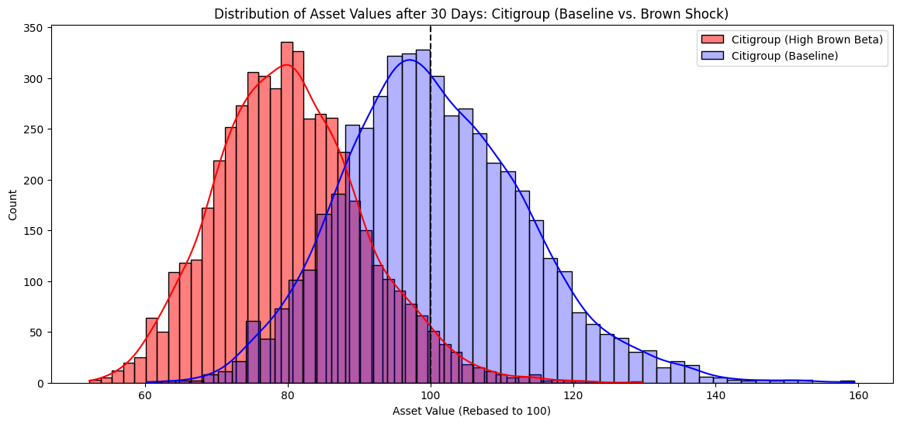
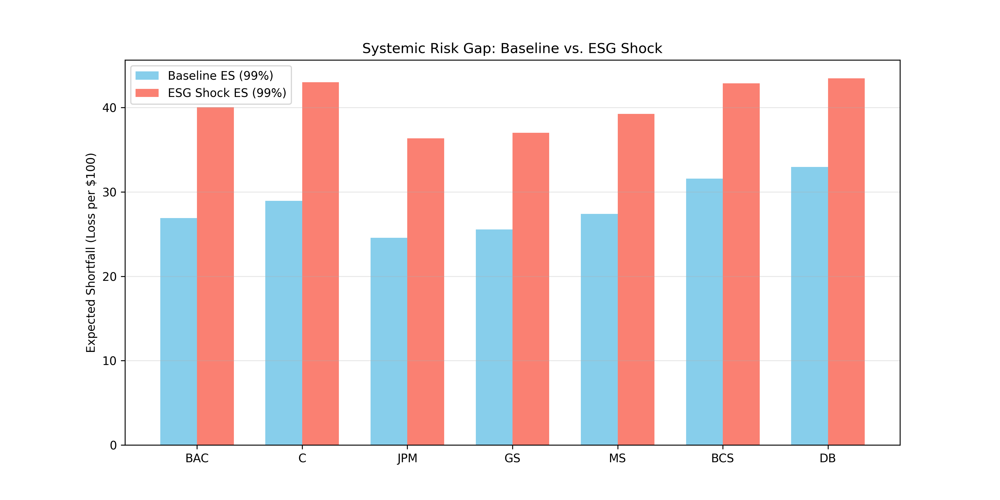

<div align="center">

<a href="report.pdf">
  
</a>

<p><em>Click the banner to view the full analysis report</em></p>

# Quantifying Systemic Risk in CCPs
### An ESG-Integrated Stress Testing Framework


</div>

---

## 📑 Table of Contents

- [Project Overview](#1-project-overview)
- [Key Empirical Results](#2-key-empirical-results)
- [Visual Analysis](#3-visual-analysis)
- [Technical Implementation](#4-technical-implementation)
- [Repository Structure](#5-repository-structure)
- [How to Run](#6-how-to-run)
- [Citation](#citation)
- [License](#-license)

---

## 1. Project Overview

**The Problem:** Central Clearing Counterparties (CCPs) manage systemic risk using historical data models (VaR). However, Climate Transition Risk (a **"Green Swan"** event) has no historical precedent. If fossil fuel assets crash abruptly, banks heavily exposed to them could default, potentially overwhelming the CCP's Default Fund.

**The Solution:** This project builds a **Monte Carlo Stress-Testing Engine** that integrates ESG factors into the standard Risk Waterfall. It quantifies the exact capital shortfall that standard models miss during a disorderly climate transition.

**Research Question:** *Does the exclusion of climate transition risk factors from standard CCP stress-testing models lead to a statistically significant underestimation of the Default Fund resources required to cover Member defaults?*

**Approach at a glance:**
- Fit **GARCH(1,1)** volatility models and rolling **ESG Betas** for 7 Global Systemically Important Banks (G-SIBs).
- Simulate 10,000 correlated price paths with a custom **Multivariate Geometric Brownian Motion (GBM)** engine, using **Cholesky Decomposition** to preserve systemic correlations under stress.
- Inject a discrete "Brown Asset Crash" jump, scaled by each bank's ESG Beta, and compare **Expected Shortfall (99%)** under Baseline vs. ESG-Shock scenarios.

---

## 2. Key Empirical Results

**Finding:** Standard risk models underestimate the tail risk of carbon-intensive members by up to **48.9%** — a gap the CCP is currently not collateralizing.

### The Systemic Risk Gap (Expected Shortfall, 99% confidence)

| Ticker | Bank | Baseline ES ($) | ESG Shock ES ($) | Risk Gap ($) | Risk Gap (%) |
| :--- | :--- | ---: | ---: | ---: | ---: |
| **BAC** | Bank of America | 26.89 | 40.05 | 13.15 | **+48.92%** |
| **C** | Citigroup | 28.96 | 42.99 | 14.03 | **+48.46%** |
| **JPM** | JPMorgan Chase | 24.55 | 36.37 | 11.81 | **+48.11%** |
| **GS** | Goldman Sachs | 25.56 | 37.02 | 11.47 | +44.86% |
| **MS** | Morgan Stanley | 27.39 | 39.23 | 11.84 | +43.22% |
| **BCS** | Barclays | 31.58 | 42.87 | 11.29 | +35.74% |
| **DB** | Deutsche Bank | 32.97 | 43.46 | 10.50 | +31.83% |

> **Interpretation:** In a standard crisis, Bank of America is expected to lose $26.89 per $100 of exposure in the tail event. Under a Climate Transition Shock, that loss balloons to $40.05 — and the CCP currently holds no collateral for the difference.

**Other notable findings:**
- The "Brown" energy proxy (XLE) exhibited annualized volatility of **21.9%**, well above the S&P 500's **13.1%**.
- Citigroup and Bank of America carry the highest "Brown Betas" (**> 0.65**), indicating deep structural linkages to the fossil fuel economy.
- European banks (DB, BCS) show a materially lower Risk Gap (~31–35%) than US banks (~44–49%) — consistent with faster EU decarbonization and lower relative exposure to heavy industry.

---

## 3. Visual Analysis

<table>
<tr>
<td width="50%">

<p align="center"><b>Figure 1.</b> Raw Daily Closing Prices — 7 G-SIB Clearing Members (2018–2024). Unadjusted price history used as an initial data-integrity check; the 2020 spike marks COVID-era volatility.</p>
</td>
<td width="50%">

<p align="center"><b>Figure 2.</b> Normalized Asset Performance (Data Quality Check). Prices indexed to 100 at the start date; ICLN's post-2020 divergence from XLE and the S&P 500 previews the Green-vs-Brown gap driving the ESG betas.</p>
</td>
</tr>
<tr>
<td width="50%">

<p align="center"><b>Figure 3.</b> Daily Log Returns & Rolling 30-Day Volatility — Brown vs. Green Energy. Top: log returns for all seven clearing members. Bottom: rolling annualized volatility of XLE (Brown) vs ICLN (Green), showing Energy's persistently higher risk profile.</p>
</td>
<td width="50%">

<p align="center"><b>Figure 4.</b> Estimated Conditional Volatility — GARCH(1,1). Fitted conditional volatility paths per G-SIB, confirming high shock persistence (α + β > 0.90 for most members) that justifies dynamic margin modeling over static VaR.</p>
</td>
</tr>
<tr>
<td width="50%">

<p align="center"><b>Figure 5.</b> Dynamic 60-Day Rolling Correlation — Banks vs. Brown/Green Energy. Tracks how each bank's correlation with fossil-fuel (top) and renewable (bottom) factors evolves, tightening noticeably during periods of market stress.</p>
</td>
<td width="50%">

<p align="center"><b>Figure 6.</b> 20-Day-Ahead Asset Value Distribution — Citigroup (Baseline vs. ESG Shock). Monte Carlo terminal-value histogram (N = 10,000); the leftward shift under the shock scenario reveals the fat left tail that standard VaR misses.</p>
</td>
</tr>
<tr>
<td colspan="2">
<p align="center"></p>
<p align="center"><b>Figure 7.</b> Systemic Risk Gap — Baseline vs. ESG-Shock Expected Shortfall (99%). The headline result: the uncollateralized capital shortfall for each G-SIB under a disorderly climate transition.</p>
</td>
</tr>
</table>

---

## 4. Technical Implementation

This framework operates using a **Code-First** methodology:

* **Data Pipeline:** Ingested 6 years of daily market data (2018–2024) for 7 G-SIBs (JPM, GS, MS, BAC, C, DB, BCS) plus ESG factor proxies (XLE, ICLN) and market regime indicators (^GSPC, ^VIX, ^TNX) via `yfinance`.
* **Econometric Modeling:** Fitted **GARCH(1,1)** models per bank to capture time-varying, persistent volatility, and computed rolling **ESG Betas** to quantify each bank's sensitivity to "Brown" (fossil fuel) shocks.
* **Simulation Engine:** Built a custom `CCPRiskEngine` — a **Multivariate Geometric Brownian Motion (GBM)** engine using **Cholesky Decomposition** to preserve systemic correlations, with a discrete ESG jump component injected at the shock scenario's start.
* **Risk Quantification:** Ran 10,000 simulated paths per scenario and computed **Expected Shortfall (ES) at 99% confidence** for Baseline vs. ESG-Shock states.

**Stack:** Python 3.9 · Jupyter Notebooks · `yfinance` (data) · `arch` (GARCH modeling) · `numpy` (matrix algebra / Cholesky) · `pandas` (data management)

---

## 5. Repository Structure

```text
├── data
│   ├── raw            # Original market data
│   └── processed      # GARCH params, Returns data
├── notebooks
│   ├── phase_1_data    # Data Ingestion & Feature Engineering
│   ├── phase_2_model    # Volatility, Correlation & Simulation Engine
│   └── phase_3_results  # Final Stress Testing & Aggregation
├── outputs
│   ├── figures         # High-res plots (PNG)
│   └── tables          # Final risk metrics (CSV)
├── src
│   ├── data_loader      # (Placeholder for production code)
│   └── models           # (Placeholder for production code)
├── requirements.txt    # Environment dependencies
├── TASKS.md            # Project development log
└── README.md
```

---

## 6. How to Run

1. Clone the repository.
2. Install dependencies: `pip install -r requirements.txt`
3. Execute the Jupyter Notebooks sequentially, from `notebooks/phase_1_data` through `notebooks/phase_3_results`.

---

## Citation

If you use this project in academic research, publications, educational materials, or derivative works, please cite it and provide appropriate credit to the original author. A [`CITATION.cff`](CITATION.cff) file is included, so GitHub also provides a **"Cite this repository"** button in the sidebar (BibTeX, APA, and other formats).

**Suggested citation:**

> Arain, S. U. R. (2026). *ccp-esg-stress-testing* (Version 1.0) [Software]. https://github.com/sanaurrehmanarain/ccp-esg-stress-testing

| | |
|---|---|
| **Author** | Sana Ur Rehman Arain |
| **Role** | Data Scientist |
| **GitHub** | [@sanaurrehmanarain](https://github.com/sanaurrehmanarain) |
| **Contact** | sana.arain.work@gmail.com |

---

## 📜 License

This project is licensed under the **MIT License** — see [LICENSE](LICENSE) for details. The license requires that the original copyright notice be retained in copies of the software.

---

<p align="center">
⭐ If this project was useful to you, consider starring the repo — it helps others discover it and supports future work.
</p>
